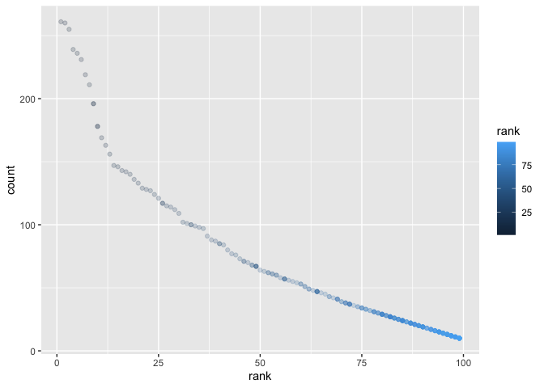

Homework 2
================

## Problem 1

\#\#\#Read and clean the Mr. Trash Wheel sheet: \#\#\#specify the sheet
in the Excel file and to omit non-data entries (rows with notes /
figures; columns containing notes) using arguments in read\_excel
\#\#\#use reasonable variable names \#\#\#omit rows that do not include
dumpster-specific data \#\#\#round the number of sports balls to the
nearest integer

``` r
library(tidyverse)
```

    ## ── Attaching packages ─────────────────────────────────────── tidyverse 1.3.1 ──

    ## ✓ ggplot2 3.3.5     ✓ purrr   0.3.4
    ## ✓ tibble  3.1.4     ✓ dplyr   1.0.7
    ## ✓ tidyr   1.1.3     ✓ stringr 1.4.0
    ## ✓ readr   2.0.1     ✓ forcats 0.5.1

    ## ── Conflicts ────────────────────────────────────────── tidyverse_conflicts() ──
    ## x dplyr::filter() masks stats::filter()
    ## x dplyr::lag()    masks stats::lag()

``` r
library(readxl)
library(dplyr)
```

## load the trash data

``` r
trash_data = read_excel("Trash-Wheel-Collection-Totals-8-6-19.xlsx") %>% 
  janitor::clean_names() %>% 
  drop_na(dumpster) %>% 
  mutate(sports_balls = round(sports_balls, digits = 0))
```

    ## New names:
    ## * `` -> ...15
    ## * `` -> ...16
    ## * `` -> ...17

\#\#median number of sports balls in 2019

``` r
median(trash_data$sports_balls)
```

    ## [1] 8

## load the precipitation data, read and clean, omit rows without data, add variable for year.

``` r
precipitation_data2018 = read_excel("Trash-Wheel-Collection-Totals-8-6-19.xlsx", sheet = "2018 Precipitation", skip = 1) %>% 
  janitor::clean_names() %>% 
  drop_na() %>% 
  mutate(year = 2018)
  sum(precipitation_data2018[,'total'])
```

    ## [1] 70.33

\#\#total precipitation in 2018

``` r
sum(precipitation_data2018[,'total'])
```

    ## [1] 70.33

``` r
precipitation_data2019 = read_excel("Trash-Wheel-Collection-Totals-8-6-19.xlsx", sheet = "2019 Precipitation", skip = 1) %>% 
  janitor::clean_names() %>% 
  drop_na() %>% 
  mutate(year = 2019)
```

## Combine precipitation datasets and convert month to a character variable

``` r
precipitation_data2018_2019 =
  bind_rows(precipitation_data2018, precipitation_data2019) %>% 
  mutate(month = month.name[as.numeric(month)])
```

## The trash\_data dataset 344 total observations and 14 variables. The variables include information about each dumpster and the weight, volume, and contents of each dumpster. A few key variables include: month, year, date, weight (tons) of trash, volume (cubic yards), number of plastic bottles, number of sports balls, etc.The median number of sports balls in a dumpster in 2019 is 8. The total precipitation in 2018 was 70.33 inches.

## PROBLEM 2: This problem uses the FiveThirtyEight data; these data were gathered to create the interactive graphic on this page. In particular, we’ll use the data in pols-month.csv, unemployment.csv, and snp.csv. Our goal is to merge these into a single data frame using year and month as keys across datasets.

## First, clean the data in pols-month.csv. Use separate() to break up the variable mon into integer variables year, month, and day; replace month number with month name; create a president variable taking values gop and dem, and remove prez\_dem and prez\_gop; and remove the day variable.

``` r
pols_data = read_csv("fivethirtyeight_datasets/pols-month.csv") %>% 
  separate("mon", into = c("year", "month", "day")) %>% 
  mutate(
    month = month.name[as.numeric(month)],
    year = as.character(year),
    president  = recode(prez_dem, "0" = "dem", "1" = "gop", "1" = "gop")) %>% 
  select(-day, -prez_dem, -prez_gop)
```

    ## Rows: 822 Columns: 9

    ## ── Column specification ────────────────────────────────────────────────────────
    ## Delimiter: ","
    ## dbl  (8): prez_gop, gov_gop, sen_gop, rep_gop, prez_dem, gov_dem, sen_dem, r...
    ## date (1): mon

    ## 
    ## ℹ Use `spec()` to retrieve the full column specification for this data.
    ## ℹ Specify the column types or set `show_col_types = FALSE` to quiet this message.

## Second, clean the data in snp.csv using a similar process to the above. For consistency across datasets, arrange according to year and month, and organize so that year and month are the leading columns.

``` r
snp_data = read_csv("fivethirtyeight_datasets/snp.csv") %>% 
  janitor::clean_names() %>% 
  separate("date", into = c("month", "day", "year"), convert = TRUE) %>% 
  mutate(
    year, year = if_else(year <= 15, year + 2000, year + 1900),
    year = as.character(year),
    month = month.name[as.numeric(month)]) %>% 
  arrange(year, month) %>% 
select(year, month, close)
```

    ## Rows: 787 Columns: 2

    ## ── Column specification ────────────────────────────────────────────────────────
    ## Delimiter: ","
    ## chr (1): date
    ## dbl (1): close

    ## 
    ## ℹ Use `spec()` to retrieve the full column specification for this data.
    ## ℹ Specify the column types or set `show_col_types = FALSE` to quiet this message.

## Third, tidy the unemployment data so that it can be merged with the previous datasets. This process will involve switching from “wide” to “long” format; ensuring that key variables have the same name; and ensuring that key variables take the same values.

``` r
unemployment_data = read_csv("./fivethirtyeight_datasets/unemployment.csv") %>% 
  janitor::clean_names() %>% 
  pivot_longer(
    jan:dec, 
    names_to = "month",
    values_to = "unemployment") %>% 
  mutate(
    year = as.character(year),
    month = recode(month, 
    jan = "January", feb = "February", mar = "March", apr = "April", may = "May", jun = "June", jul = "July", aug = "August", sep = "September", oct = "October", nov = "November", dec = "December"))
```

    ## Rows: 68 Columns: 13

    ## ── Column specification ────────────────────────────────────────────────────────
    ## Delimiter: ","
    ## dbl (13): Year, Jan, Feb, Mar, Apr, May, Jun, Jul, Aug, Sep, Oct, Nov, Dec

    ## 
    ## ℹ Use `spec()` to retrieve the full column specification for this data.
    ## ℹ Specify the column types or set `show_col_types = FALSE` to quiet this message.

## Join the datasets by merging snp into pols, and merging unemployment into the result.

``` r
snp_pols_data = 
  left_join(snp_data, pols_data)
```

    ## Joining, by = c("year", "month")

``` r
snp_pols_unemployment_data = 
  left_join(snp_pols_data, unemployment_data)
```

    ## Joining, by = c("year", "month")

\#\#Description of the FiveThirtyEight Datasets

The pols\_data dataset includes data on the number of politicians who
are either democratic ‘dem’ or republican ‘gop’ at any given time (month
and year). There are 822 observations and 9 variables. Key variables
included in this dataset are: mon (date of the count), gov\_gop (\# of
of gop senators on date), sen\_gop, rep\_dem, etc.

The snp\_data includes data on the Standard & Poor’s stock market index
(S&P), which is often used to represent the measure of the entire stock
market. This dataset contains 787 observations and 2 varaibles, “date”
(the date of observations) and “close” (the closing values of the S&P
stock index on the assocated date).

The unemployment\_data dataset contains 68 observations and 13
variables. Some of the key variables include ‘year’ (the year
measurements) and the month, from January to December (percentage of
employment per month)

## PROBLEM 3

### This problem uses data from NYC Open data on the popularity of baby names, and can be downloaded here.

Load and tidy the data. Note that, although these data may seem fairly
well formatted initially, the names of a categorical predictor and the
case structure of string variables changed over time; you’ll need to
address this in your data cleaning. Also, some rows seem duplicated, and
these will need to be removed (hint: google something like “dplyr remove
duplicate rows” to get started).

Produce a well-structured, reader-friendly table showing the rank in
popularity of the name “Olivia” as a female baby name over time; this
should have rows for ethnicities and columns for year. Produce a similar
table showing the most popular name among male children over time.

``` r
babynames_data = read_csv("Popular_Baby_Names.csv") %>%
 janitor::clean_names() %>% 
mutate(
    gender = str_to_lower(gender), 
    ethnicity = str_to_lower(ethnicity),
    childs_first_name = str_to_lower(childs_first_name),
    ethnicity = as.character(ethnicity),
    ethnicity = recode(ethnicity,
                       "asian and paci” = “asian and pacific islander”,
                       “black non hisp” = “black non hispanic”,
                       “white non hisp" = "white non hispanic")) %>% 
distinct()
```

    ## Rows: 37537 Columns: 6

    ## ── Column specification ────────────────────────────────────────────────────────
    ## Delimiter: ","
    ## chr (3): Gender, Ethnicity, Child's First Name
    ## dbl (3): Year of Birth, Count, Rank

    ## 
    ## ℹ Use `spec()` to retrieve the full column specification for this data.
    ## ℹ Specify the column types or set `show_col_types = FALSE` to quiet this message.

``` r
table_olivia = babynames_data %>% 
filter(childs_first_name == "olivia") %>% 
  select(-gender, -childs_first_name, -count) %>% 
  pivot_wider(
    names_from = year_of_birth,
    values_from = rank
  ) 
```

### Produce a similar table showing the most popular name among male children over time.

``` r
babynames_data = read_csv("Popular_Baby_Names.csv") %>%
 janitor::clean_names() %>% 
mutate(
    gender = str_to_lower(gender), 
    ethnicity = str_to_lower(ethnicity),
    childs_first_name = str_to_lower(childs_first_name),
    ethnicity = as.character(ethnicity),
    ethnicity = recode(ethnicity,
                       "asian and paci” = “asian and pacific islander”,
                       “black non hisp” = “black non hispanic”,
                       “white non hisp" = "white non hispanic")) %>% 
distinct(.keep_all = TRUE)
```

    ## Rows: 37537 Columns: 6

    ## ── Column specification ────────────────────────────────────────────────────────
    ## Delimiter: ","
    ## chr (3): Gender, Ethnicity, Child's First Name
    ## dbl (3): Year of Birth, Count, Rank

    ## 
    ## ℹ Use `spec()` to retrieve the full column specification for this data.
    ## ℹ Specify the column types or set `show_col_types = FALSE` to quiet this message.

``` r
table_malenames = 
  babynames_data %>% 
filter(gender == "male", rank == "1") %>% 
  select(-gender, -rank, -count) %>% 
  pivot_wider(
    names_from = year_of_birth,
    values_from = childs_first_name)
```

\#Finally, for male, white non-hispanic children born in 2016, produce a
scatter plot showing the number of children with a name (y axis) against
the rank in popularity of that name (x axis).

``` r
male_2016_names_wnh = 
  babynames_data %>% 
  filter(gender == "male", ethnicity == "white non hispanic", year_of_birth == 2016 )
```

``` r
  ggplot(male_2016_names_wnh, aes(x = rank, y = count, color = rank)) + geom_point(alpha= .2)
```

<!-- -->
